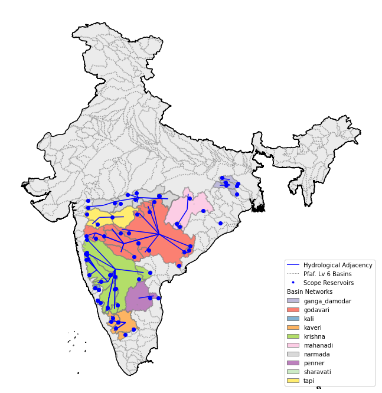

# Wave2Web: H2Ox
This github org contains all the repos associated with H2Ox's winning submission to the Wave2Web Hack and the associated draft publication [Wave2Web: Near-real-time reservoir volume prediction for water security in India]().

The Wave2Web hackathon, organised by the World Resources Institute and sponsored by Microsoft and Blackrock, took place May through September 2021.
The objective of the hackathon was to predict, up to 90 days in the future, the water availability at 4 key reservoirs in the Kaveri basin to the West of Bengaluru. After the hackathon, the H2Ox team took the challenge further and is now providing near-real-time predictions for 70 reservoirs accross India.

**h2ox scope basin networks and reservoirs**

The H2Ox team is [Lucas Kruitwagen](https://github.com/Lkruitwagen), [Chris Arderne](https://github.com/carderne), [Tommy Lees](https://github.com/tommylees112), and [Lisa Thalheimer](https://github.com/geoliz).

## Contents

This github org contains the following repositories:
- [h2ox-data](https://github.com/H2Oxford/h2ox-data): Repo for containerised services to fetch ERA5 data and ingest it to a zarr archive
- [h2ox-forecast](https://github.com/H2Oxford/h2ox-forecast): Repo for containerised services to fetch TIGGE data and ingest it to a zarr archive
- [h2ox-chirps](https://github.com/H2Oxford/h2ox-chirps): Repo for containerised services to fetch CHIRPS data and ingest it to a zarr archive
- [h2ox-reducer](https://github.com/H2Oxford/h2ox-reducer): Repo for containerised services to geospatially reduce zarr archive data to timeseries and push to a BigQuery table
- [h2ox-ai](https://github.com/H2Oxford/h2ox-ai): Repo for training and containerised serving of ML models for water volume prediction
- [h2ox-w2w](https://github.com/H2Oxford/h2ox-w2w): Repo for near-real-time orchestration: fetching data from India-WRIS, fetching inference, and pushing inference to a BigQuery table
- [h2ox-api](https://github.com/H2Oxford/h2ox-api): Repo for containerised serving data from a cached BigQuery table
- [h2ox-dash](https://github.com/H2Oxford/h2ox-dash): Repo for lightweight frontend dashboard showing basic problem context and near-real-time inference.

## Reproduceability

The repos in this organisation contain everything needed to fully reproduce the h2ox api and service. Appropriate accounts will be required to acquire data from the [Copernicus Data Store](https://cds.climate.copernicus.eu/#!/home), to deploy containerised cloud services, and set up cloud storage and query tables as appropriate.

The figure below shows the flow of data through all the services.

**h2ox system architecture**

To just work with the reduced dataframes used in [h2ox-ai](https://github.com/H2Oxford/h2ox-ai), these are available at [gs://oxeo-public/wave2web](https://console.cloud.google.com/storage/browser/oxeo-public/wave2web). Further access to the zarr archives and bigquery tables can be provided on request.

## Contact

Please get in touch with us via github issues with any questions or feedback! Pull requests are also welcome!
